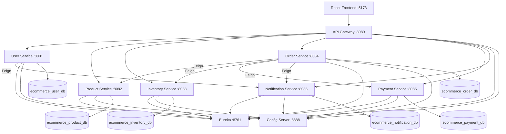
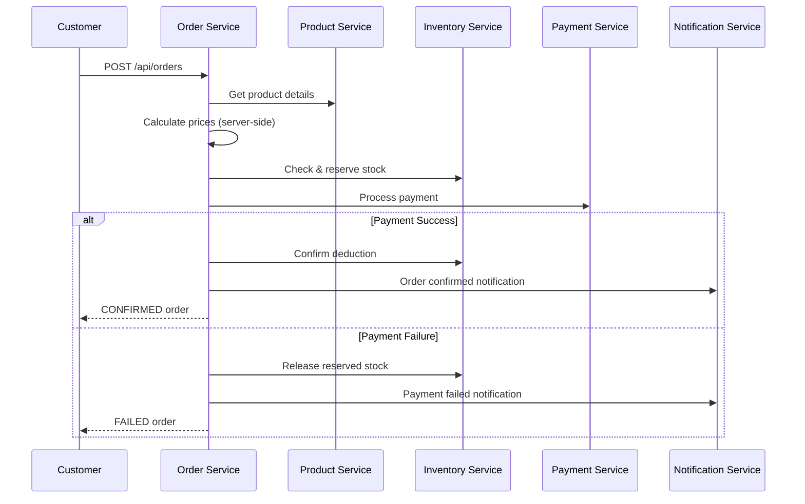

# Enterprise E-Commerce Order Management System

A production-style academic capstone project demonstrating microservices architecture for e-commerce order management.

## Problem Statement

Modern e-commerce platforms require scalable, resilient systems that can handle user management, product catalog, inventory, payments, and order orchestration across independent services. This project implements a complete order management workflow with service discovery, centralized configuration, API gateway security, and a React frontend.

## Features

- **Microservices architecture** with 9 backend services
- **JWT authentication** with role-based access (CUSTOMER, ADMIN)
- **Complete order workflow** — validate → price → reserve inventory → pay → confirm/cancel
- **Inventory management** with optimistic/pessimistic locking and idempotent reservations
- **Simulated payment processing** with refund support
- **Notification service** with console logging and persistence
- **Resilience4j** circuit breaker and retry on order service integrations
- **OpenFeign** inter-service communication via Eureka
- **React SPA** with cart, checkout, admin dashboard, and order management

## Architecture



## Order Workflow



## Technology Stack

| Layer | Technologies |
|-------|-------------|
| Backend | Java 17, Spring Boot 3.2, Spring Cloud, JPA, Security, JWT |
| Database | MySQL (Aiven Cloud) — database-per-service |
| Discovery | Netflix Eureka |
| Config | Spring Cloud Config Server |
| Gateway | Spring Cloud Gateway |
| Resilience | Resilience4j, OpenFeign |
| API Docs | Springdoc OpenAPI |
| Frontend | React, Vite, JavaScript, Axios, React Router |
| Build | Maven, npm |

## Folder Structure

```
enterprise-ecommerce/
├── backend/
│   ├── pom.xml                 # Parent Maven POM
│   ├── config-server/          # Centralized configuration
│   ├── eureka-server/          # Service discovery
│   ├── api-gateway/            # API Gateway + JWT filter
│   ├── user-service/
│   ├── product-service/
│   ├── inventory-service/
│   ├── order-service/
│   ├── payment-service/
│   └── notification-service/
├── frontend/                   # React + Vite SPA
├── .env.example
├── PROJECT_STATE.md
└── FINAL_IMPLEMENTATION_REPORT.md
```

## Database Architecture

Each microservice owns its database (database-per-service pattern):

| Service | Database |
|---------|----------|
| User | `ecommerce_user_db` |
| Product | `ecommerce_product_db` |
| Inventory | `ecommerce_inventory_db` |
| Order | `ecommerce_order_db` |
| Payment | `ecommerce_payment_db` |
| Notification | `ecommerce_notification_db` |

> **Note:** Development uses `spring.jpa.hibernate.ddl-auto=update`. Production should use Flyway or Liquibase migrations.

## Aiven MySQL Setup

1. Create an Aiven MySQL service
2. Create 6 logical databases (one per service)
3. Copy connection details to your `.env` file
4. Enable SSL (Aiven requires SSL by default)

## Environment Variables

Copy `.env.example` to `.env` and fill in values:

```bash
cp .env.example .env
```

Required variables:
- `AIVEN_MYSQL_HOST`, `AIVEN_MYSQL_PORT`, `AIVEN_MYSQL_USER`, `AIVEN_MYSQL_PASSWORD`
- `JWT_SECRET` (minimum 32 characters)
- `CONFIG_SERVER_URL`, `EUREKA_SERVER_URL`
- `VITE_API_BASE_URL` (for frontend)

**Never commit `.env` with real credentials.**

## Prerequisites

- **Java 17** (required — Lombok does not work with Java 24)
- Maven 3.8+
- Node.js 18+
- MySQL (Aiven or local)

```bash
# macOS: install Java 17
brew install openjdk@17
export JAVA_HOME="/opt/homebrew/opt/openjdk@17/libexec/openjdk.jdk/Contents/Home"
```

## Startup Order

Export environment variables from `.env`, then start services in this order:

```bash
# 1. Config Server
cd backend/config-server && mvn spring-boot:run

# 2. Eureka Server
cd backend/eureka-server && mvn spring-boot:run

# 3. Business Services (can run in parallel)
set -a
source ../../.env
set +a
mvn spring-boot:run
cd backend/user-service && mvn spring-boot:run
cd backend/product-service && mvn spring-boot:run
cd backend/inventory-service && mvn spring-boot:run
cd backend/payment-service && mvn spring-boot:run
cd backend/notification-service && mvn spring-boot:run
cd backend/order-service && mvn spring-boot:run

# 4. API Gateway
cd backend/api-gateway && mvn spring-boot:run

# 5. Frontend
cd frontend && npm install && npm run dev
```

Or build all backend modules first:

```bash
export JAVA_HOME="/opt/homebrew/opt/openjdk@17/libexec/openjdk.jdk/Contents/Home"
cd backend && mvn clean install
```

## API Gateway Routes

| Route | Service |
|-------|---------|
| `/api/auth/**` | USER-SERVICE |
| `/api/users/**` | USER-SERVICE |
| `/api/products/**` | PRODUCT-SERVICE |
| `/api/categories/**` | PRODUCT-SERVICE |
| `/api/inventory/**` | INVENTORY-SERVICE |
| `/api/orders/**` | ORDER-SERVICE |
| `/api/payments/**` | PAYMENT-SERVICE |
| `/api/notifications/**` | NOTIFICATION-SERVICE |

## Authentication Flow

1. Customer registers or logs in via `/api/auth/register` or `/api/auth/login`
2. User Service returns JWT containing `userId`, `email`, `role`
3. Frontend stores token in `localStorage`
4. All protected requests include `Authorization: Bearer <token>`
5. API Gateway validates JWT and forwards `X-User-Id`, `X-User-Role`, `X-User-Email` headers
6. Services derive identity from gateway headers (never trust client-sent userId)

## Development Credentials

Seeded when `SEED_DATA_ENABLED=true` (local dev only):

| Role | Email | Password |
|------|-------|----------|
| Admin | admin@ecommerce.com | admin123 |
| Customer | customer@ecommerce.com | customer123 |

## Swagger URLs

Access via each service directly (or through gateway for routed paths):

| Service | URL |
|---------|-----|
| User | http://localhost:8081/swagger-ui.html |
| Product | http://localhost:8082/swagger-ui.html |
| Inventory | http://localhost:8083/swagger-ui.html |
| Order | http://localhost:8084/swagger-ui.html |
| Payment | http://localhost:8085/swagger-ui.html |
| Notification | http://localhost:8086/swagger-ui.html |

## Actuator URLs

| Service | Health |
|---------|--------|
| Config Server | http://localhost:8888/actuator/health |
| Eureka | http://localhost:8761/actuator/health |
| API Gateway | http://localhost:8080/actuator/health |
| User | http://localhost:8081/actuator/health |
| Product | http://localhost:8082/actuator/health |
| Inventory | http://localhost:8083/actuator/health |
| Order | http://localhost:8084/actuator/health |
| Payment | http://localhost:8085/actuator/health |
| Notification | http://localhost:8086/actuator/health |

## Testing

```bash
export JAVA_HOME="/opt/homebrew/opt/openjdk@17/libexec/openjdk.jdk/Contents/Home"
cd backend && mvn test
```

Tests cover: user registration/login, product CRUD, inventory reservation, payment simulation, order workflow.

## Frontend Build

```bash
cd frontend
npm install
npm run build    # production build
npm run dev      # development server at http://localhost:5173
```

## Troubleshooting

| Issue | Solution |
|-------|----------|
| Lombok compilation errors | Use Java 17, not Java 24 |
| Services not registering | Ensure Eureka starts before business services |
| Config not loading | Start Config Server first; check `CONFIG_SERVER_URL` |
| 401 Unauthorized | Verify JWT_SECRET matches across gateway and services |
| DB connection failed | Check Aiven credentials and SSL settings in `.env` |
| CORS errors | Set `CORS_ALLOWED_ORIGINS=http://localhost:5173` |

## Future Improvements

- Flyway/Liquibase database migrations
- Kafka/RabbitMQ for async events
- Redis caching for product catalog
- Kubernetes deployment manifests
- Distributed tracing (Zipkin/Jaeger)
- Rate limiting at API Gateway
# Ecommerce-microservices-platform
